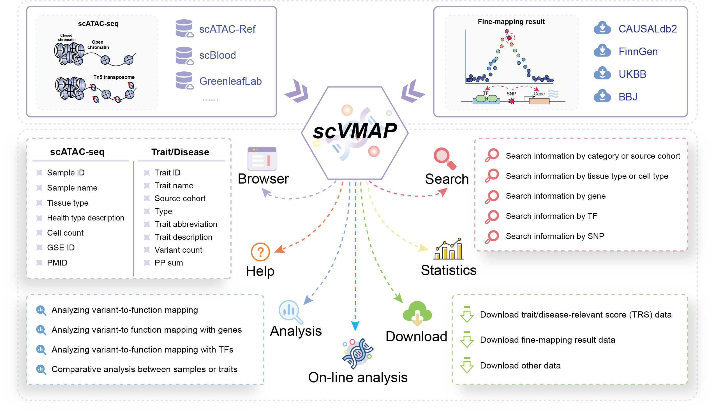

# Welcome to scVMAP!

> scVMAP: https://bio.liclab.net/scvmap/

> scVMAP reproducibility:: https://github.com/YuZhengM/scvmap_reproducibility

> scVMAP tutorial: https://scvmap.readthedocs.io/en/latest/

> scVMAP front-end: https://github.com/YuZhengM/scvmap_web

> scVMAP back-end: https://github.com/YuZhengM/scvmap

> scVMAP API: https://bio.liclab.net/scvmap_service/swagger-ui/index.html

A comprehensive platform for **integrating** `single-cell chromatin accessibility regions` with `causal variants`.

scVMAP is a user-centric database that offers intuitive workflows, customizable parameters, and comprehensive data accessibility, featuring:

1. Integrates causal variants with chromatin accessibility regions at single-cell resolution.
2. Includes data from 183 scATAC-seq samples and 15,884 fine-mapping datasets.
3. Encompasses over 1.9 million effective trait-sample pairs, 13.1 million trait-cell type pairs, and 16.05 billion trait-cell pairs.
4. Performs enrichment analysis for traits across specific cells or cell types.
5. Identifies relevant genes and transcription factors (TFs), and performs pathway enrichment analysis for these genes in the context of specific samples and traits.
6. Constructs an integrated regulatory network (variant-TF-gene) linking traits to samples.
7. Offers comprehensive resources for data download.
8. Makes the code for reproducing the database workflow publicly available.
9. Publishes the full-stack development code for the web application.
10. Provides API interfaces for programmatic data access.

